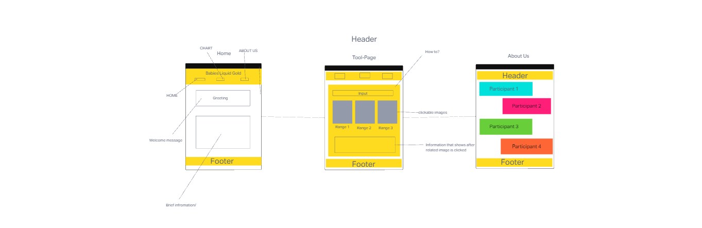

# babies-liquid-gold

<h1><u>Authors:</u></h1>
Arianne Boyd, Cody Bonner, Avielle Lewis, Stacy Jones

https://babies-liquid-gold.github.io/babies-liquid-gold/

A web application created to help moms log daily breastmilk production and receive advice and tips on how to increase or maintain healthy daily production.

<strong><u>Problem Domain:</u></strong>

All over the world women are becoming moms everyday and they often face the issue of not producing enough breastmilk to feed their babies the proper nutrition that they need daily. It can be disappointing to find out that you are not able to provide what your child needs naturally and have to rely on milk alternatives such as cow's milk or formula to get the job done. We all deserve the opportunity to bond with our babies and know that they are getting the absolute best of what they need.

This is why Babies Liquid Gold will play a vital role in making that happen. It will allow for moms to log their daily production and provide tips and advice based on their output on ways they can begin to produce larger amounts of healthy breastmilk daily.

<strong><u>Languages Used</u></strong>

1. JavaScript
2. HTML
3. CSS

Reference Links:

[Domain Model](https://codex-code102.invisionapp.com/freehand/Domain-Model-fD5wyl2gz)